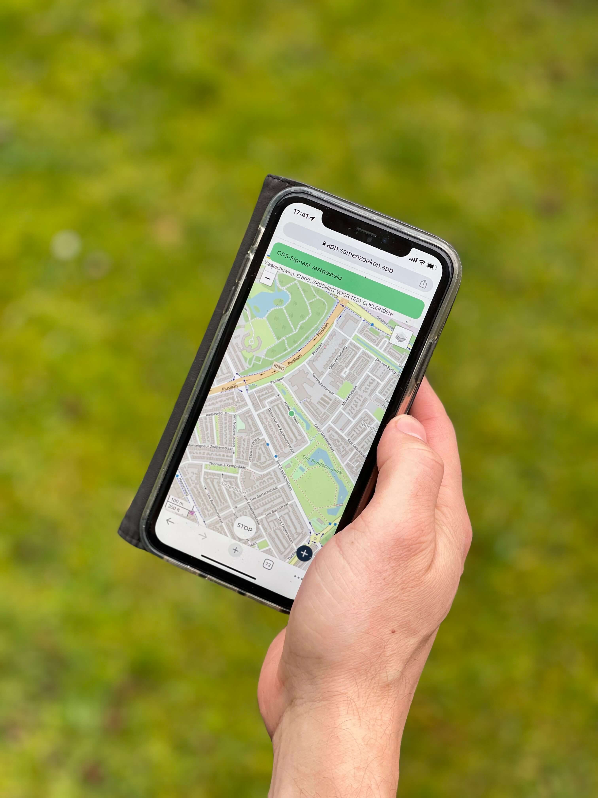

In een gesloten groep, van vooral familie, zijn de eerste testen van de Samen Zoeken Prototype uitgevoerd. Daarbij kunnen alvast belangrijke aannamens getest worden. Hoe accuraat is een gemiddeld mobiel toestel? Lukt het iedereen om hun locatie te delen? Is het duidelijk en begrijpelijk? 

Er zijn meer dan **60** routes gelopen, met samen meer dan **10 000** coördinaten. 

### Accuraatheid

Accuraatheid van iPhone's was gemiddeld 4 meter van de gegeven coördinaat en voor Android gemiddeld 6 meter. Waarbij oudere toestellen/besturingssystemen ook minder accuraat waren. Meer dan 95% van de gewandelde routes was binnen 10 meter nauwkeurig. 

**Conclusie**: Vanuit de app zullen enkel coördinaten die beter dan 10 meter nauwkeurig zijn gebruikt worden.

:::caution
Accuraatheid van gps coordinaten wordt gerapporteerd door de mobiele telefoon zelf. Wat niet accuraat kan zijn.
:::

### Toestemming locatie delen
100% van de gebruikers in deze testfase heeft aangegeven dat het was gelukt om toestemming te geven om hun locatie te delen. Hiervan moest 28% wel hun instellingen aanpassen, maar dat is gelukt met de [locatie uitleg](../../docs/app/locatie).

### Website ipv App
In deze testfase hebben we gewerkt met een prototype in de vorm van een website. Hierdoor hoefde niets in de Appstores gezocht, gedownload en geïnstalleerd te worden. Alsook kunnen via een website ook updates veel sneller gedaan worden zonder toestemming van Apple of Google.

Echter het grote nadeel van een website is dat locatie/gps tracking alleen werkt zolang de website op de voorgrond is. Dus als bv het scherm uitvalt dan worden er geen gps coördinaten verkregen. 

Dit is door 80% van de test gebruikers als storend ervaren en was onintuïtief, bv sommigen staken hun toestel meteen na het starten in hun zak. 

**Conclusie**: Een app is vereist (in tegenstelling tot een website) die blijft tracken, ook als de app op de achtergrond is voor de beste gebruikerservaring, zo kan de gebruiker zich focussen op het zoeken en niet op z'n toestel.

### Feedback

In deze testfase is een hoop feedback ontvangen, over wat er goed ging, zoals 100% vond de app eenvoudig in gebruik en de kaarten gedetailleerd zelfs met kleine bospaadjes, maar ook feedback over wat we nog verder kunnen verbeteren, bv met betrekking tot het contrast van de kleuren of batterij duur.

Bedankt aan eenieder om mee te helpen testen!