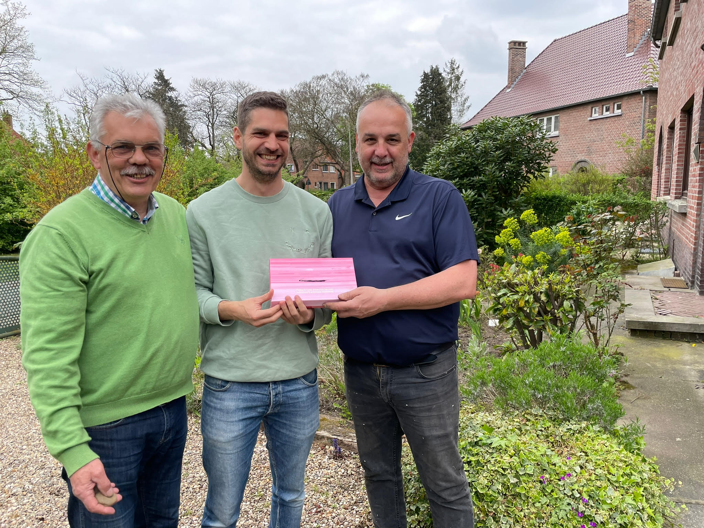

Nu de Stichting Samen Zoeken App officieel is [opgericht](/blog/oprichting-stichting), geeft Ben nog graag wat meer informatie over hoe [er gedoneerd kan worden](/docs/doneer), waar het geld naartoe gaat en ook zeker waar het geld niet naartoe gaat.

Maar eerst en vooral wil hij graag zijn familie bedanken voor de gulle donaties, die ervoor gezorgd hebben dat de onkosten om de Stichting Samen Zoeken App op te kunnen starten helemaal gedekt werden. Elke euro bracht de stichting een stapje dichterbij.

Daarnaast een woordje extra uitleg over de donaties. De Samen Zoeken app is helemaal gratis en wordt zonder betaalmodel aangeboden, maar bij het ontwikkelen ervan komt wel het een en ander kijken.

Niet alleen het opstarten van de stichting zelf kost geld (€600), maar ook de inschrijving in de Kamer van Koophandel (€75), de privacy statement (€250) en de algemene voorwaarden (€600) hebben een prijskaartje. Daarbij komen ook nog de kosten voor de ontwikkelaars licenties voor zowel Google (eenmalige kost van $25) als Apple (jaarlijks e kost van $99).

Verder gaan de donaties ook naar administratieve kosten en toekomstige investeringen in de app, zoals het bekostigen van vertalingen en lanceringen in andere landen.

Dit betekent dat al het geld dat er binnenkomt rechtstreeks naar de app en/of de stichting gaat. Er wordt enkel gewerkt met mensen die gratis hun steentje willen bijdragen; alle ontwikkelingen gebeuren op vrijwillige basis, er worden geen salarissen uitbetaald – ook niet voor het bestuur.

Doneren kan via de volgende link: https://bunq.me/samenzoeken of door rechtstreeks over te schrijven naar IBAN: NL79 BUNQ 2087 7981 25 op naam van Samen Zoeken.

Meer informatie over [donaties vind je hier](/docs/doneer).