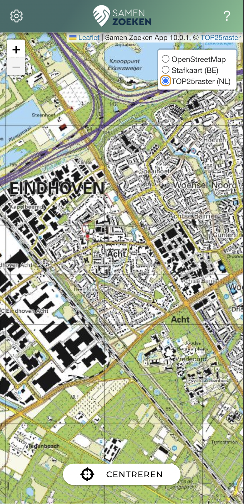

Beste vrijwilligers,

We hebben recent een onderhoudsupdate doorgevoerd voor de Samen Zoeken App om te voldoen aan de nieuwste veiligheidseisen van Apple en Google. Daarnaast hebben we enkele verbeteringen aangebracht:

- Officiële Top25raster kaarten voor Nederland werken weer.
- Verbeterde functionaliteit voor het rondkijken op de kaart en eenvoudig opnieuw centreren.
- Probleem opgelost waarbij de kaart soms niet meer gecentreerd was bij het roteren van het toestel.

Nieuwsgierig naar deze update? Update dan nu de app op de [Apple Appstore](https://apps.apple.com/us/app/samenzoeken/id6449149051?itsct=apps_box_link&itscg=30200) 
en de [Google Playstore](https://play.google.com/store/apps/details?id=app.samenzoeken).

Dank voor jullie voortdurende steun en betrokkenheid! 

Met vriendelijke groet,

Ben
Oprichter, Stichting Samen Zoeken App