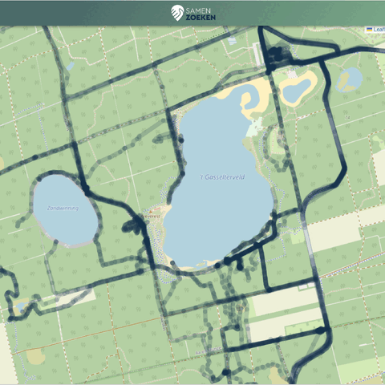

 In de afgelopen dagen hebben meer dan 1000 vrijwilligers zich ingezet voor de zoektocht naar de vermiste Diëm (20 jaar) in het gebied rond 't Gasselterveld. Tijdens deze zoektocht werd, op eigen initiatief van de betrokken familie en vrienden, de Samen Zoeken app gebruikt als hulpmiddel. In totaal werd met behulp van de app meer dan 2000 kilometer afgelegd en gezamenlijk 400 uur gezocht over 3 dagen.
 
Ondanks deze enorme inspanningen wordt Diëm op dit moment nog steeds vermist. We blijven de zoekactie naar Diëm met ons hart volgen en hopen op een goede afloop.

## App doorstond eerste grote test
Hoewel de app eerder op kleinere schaal werd gebruikt, was dit de eerste keer dat een grootschalige zoekactie ermee werd ondersteund. Ondanks de enorme toename in gebruikers bleef de app stabiel en betrouwbaar:
- 100% beschikbaarheid op zowel Android als iOS.
- Meer dan 1000 gebruikers tegelijk.
- Slechts 5% van de servercapaciteit benut, wat betekent dat de app mogelijk tot 5000-10.000 zoekers tegelijk kan ondersteunen.

## Blijvende ontwikkeling
De afgelopen dagen hebben waardevolle inzichten opgeleverd om de app verder te optimaliseren. Op basis van deze ervaringen verschijnt deze week een update.