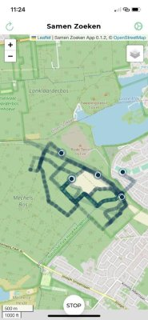

# Hoe werkt Het

De app stelt u in staat routes op te nemen op één gemeenschappelijke kaart. Een strava run, maar dan met meerdere personen tegelijk. 
Zo kunt u in één oogopslag zien waar er al iemand gezocht heeft en waar nog niet.  

## 1. Gemeenschappelijke kaart

Na het openen van de app ziet u de gemeenschappelijke kaart, met alle routes die al gelopen zijn. 

U kunt [hier lezen](/docs/maps) welke kaarten er voorhanden zijn en hoe u kunt wisselen van stafkaart.

 *Tip*: Hoe dikker de lijn, hoe meer mensen dat pad al belopen hebben.

:::tip
U kunt live via de browser (op groot scherm) volgen waar er gelopen wordt via [https://app.samenzoeken.app](https://app.samenzoeken.app). 
Handig in de controle post en voor iedereen die op basis van de laatste zoekgebieden wil coördineren.
:::

## 2. Start met opnemen van uw route

Klik op **start** om uw route op te nemen. 

Zodra u start, begint de app met het opnemen van uw route en op regelmatige intervallen deelt de app uw route met anderen die op dat moment de app open hebben. 

U ziet uzelf als het *groen* bolletje en anderen ziet u als *blauwe* bolletjes.
:::tip
We adviseren om de app **Altijd** toegang te geven tot uw locatie. Dit betekent dat de app uw coördinaten ontvangt ook als uw scherm uitstaat. 
Dit bespaart batterij en zodoende kunt u zich focussen op het zoeken. 
:::

## 3. Route beëindigen

Klik op **stop** om uw route te beëindigen.

:::info
Wij hechten veel waarde aan de bescherming van uw persoons- en locatiegegevens.
Daarom [anonimiseren](/docs/privacy#anoniem) we uw (locatie)data en [bewaren we uw locatiedata niet langer dan nodig](/docs/data#data-wordt-automatisch-verwijderd).
:::
:::caution
Vergeet niet de route te **stoppen** anders kan het zijn dat uw route tot bij uw thuis opgenomen wordt, wat niet wenselijk kan zijn. 

Moest er desondanks route informatie opgenomen zijn die u liever niet wil delen, dan kan u uw [data laten verwijderen](/docs/data).
:::
