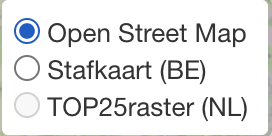
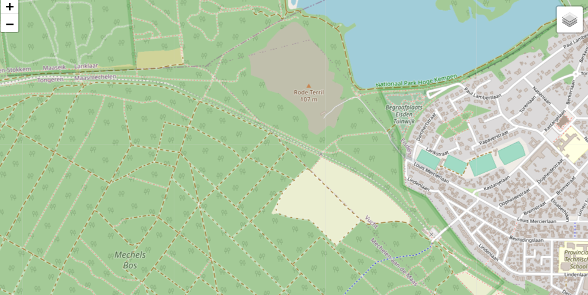
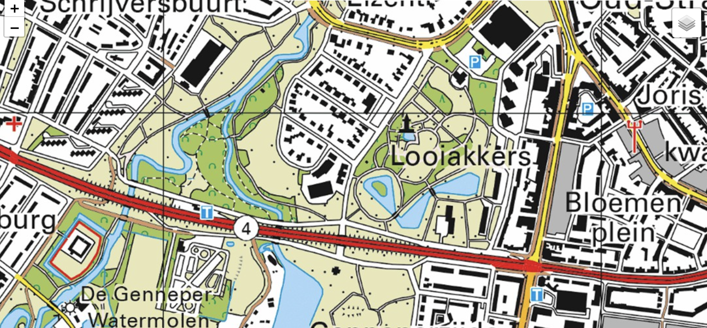

# Kaarten

De Samen Zoeken App integreert verschillende professionele kaarten. Er is een bewuste keuze gemaakt voor gedetailleerde kaarten die ook in een bosrijke omgeving nauwkeurig zijn. 
Het kan voorkomen dat sommige kaarten specifieker zijn in sommige gebieden, daarom bieden we verschillende keuzes aan zodat u zelf kan kiezen welke kaart het beste bij de zoekactie past.

## Wisselen van kaart

Wisselen van kaart kan eenvoudig. Open de app en zorg dat een kaart in beeld is. 
Bovenin ziet u het bovenstaand icoon. Met deze knop kunt u kiezen naar welke kaart u wilt wisselen.

Als een kaart niet aanklikbaar is, zoals onderstaand voorbeeld, dan kan het zijn dat deze niet beschikbaar op dit zoomniveau.
Zoom verder in op de kaart door op '+' te klikken om de kaart beschikbaar te maken.

## Standaard: [OpenStreetMap](https://www.openstreetmap.org/)
Deze kaart staat standaard ingesteld als u de app voor het eerst opent. 
Deze kaart is gebleken, in de zoekacties tot nu toe, als één van de nauwkeurigste te zijn, vooral in bosrijke gebieden. 

## Stafkaart **België**  door [CartoWeb.be](http://www.cartoweb.be)
Sinds 2019 werd CartoWeb.be als autenthieke bron erkend door de Federale Overheidsdienst. 
Deze kaart wordt gebruikt door officiële zoekinstanties. 
Deze kaart wordt 3x per jaar geupdate door NGI en mag gratis gebruikt worden voor niet commerciële doeleinden.

:::caution
Alleen zichtbaar op Belgisch grondgebied
:::

## TOP25raster **Nederland** door [Kadaster.nl](https://www.kadaster.nl/zakelijk/producten/geo-informatie/topraster)
TOPraster bestaat uit de digitale versies van de topografische kaartseries van het Kadaster.
Het Kadaster actualiseert ieder jaar TOPraster.

:::caution
Alleen zichtbaar op Nederlands grondgebied
:::

## Suggesties

Heeft u suggesties voor kaarten die u graag wilt zien? Contacteer ons, we horen graag gemotiveerd, waarom u deze kaart geïntegreerd wilt hebben. 
